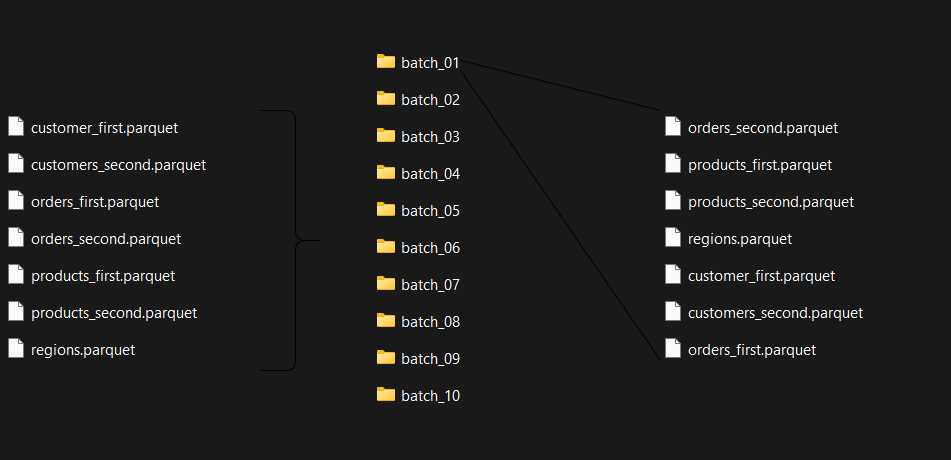
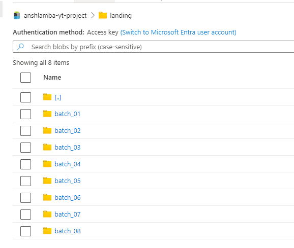

# Order Data Normalization Project

> [!NOTE]
> This project is based on [Ansh Lamba's Azure Databricks End-To-End Project 2025](https://www.youtube.com/watch?v=4uKRzDf0zIc&t=21135s), but I focused on incremental data processing instead of following Ansh's instructions. You can get the data [here](https://github.com/anshlambagit/Databricks-EndToEnd-Project).

## 1. Preparing Data

### Dividing into Batches

The provided data is a full load. To prepare it for incremental data processing, I had AI write a script that divides it into 10 batches.

> [!NOTE]
> In this README, a **batch** means one of the `batch_N` folders I created. This is different from a Spark Structured Streaming **micro-batch**, which is the internal unit Spark uses to process data.



### Uploading to ADLS Gen2 Cloud Storage

In the first stage I uploaded 8 batches and kept 2 back to trigger the Databricks Job later.



## 2. Ingesting Data

### Auto Loader

Databricks Auto Loader is a Structured Streaming source that incrementally and efficiently processes new data files as they arrive in cloud storage. It avoids re-processing files that were already ingested and minimizes file-listing overhead, which keeps cluster performance consistent as data volume grows. By default (directory listing mode) it still lists the storage location, but it does so incrementally. File notification mode (`cloudFiles.useNotifications`) reduces listing further.

Auto Loader keeps track of the **files** it has discovered and processed in the checkpoint location. It does not know about my `batch_N` folders. When new batches arrive, it checks the checkpoint and skips the files it has already read.

### Bronze Layer

There are 7 files in each batch: `customer_first` (the missing "s" is a typo in the source file name, but I kept it as is), `customers_second`, `orders_first`, `orders_second`, `products_first`, `products_second` and `regions`.

Customers, orders and products are split into two parts each, and they have to be merged into a single Delta table. In the `entities` dictionary, the keys are the names of the bronze layer tables (used as `table`), and the values are lists of the source file names to read (used as `sources`).

```python
entities = {
    "customers": ["customer_first", "customers_second"],
    "orders":    ["orders_first",   "orders_second"],
    "products":  ["products_first", "products_second"],
    "regions":   ["regions"],
}
```

`.format("cloudFiles")` activates the Auto Loader engine. The file format, schema location, checkpoint location, source path and target table name are defined, and metadata columns are appended. The two locations serve different purposes: `schemaLocation` stores the inferred schema and its evolution, while `checkpointLocation` stores the stream's state (which files have been processed).

`.trigger(availableNow=True)` is critical. Without it, the query runs as a continuous stream. With it, Auto Loader processes all files available at the start of the run in micro-batches and shuts down automatically. Files that arrive while the run is in progress are picked up by the next run, which is exactly what I need when I upload the remaining 2 batches and trigger the job.

```python
for table, sources in entities.items():
    bronze_table = f"{catalog_name}.{bronze_schema}.{table}"

  for file in sources:
      source_path = f"{landing_path}/*/{file}"
      checkpoint_path = f"{checkpoint_base}/{table}/{file}"

      (spark.readStream
          .format("cloudFiles")
          .option("cloudFiles.format", "parquet")
          .option("cloudFiles.schemaLocation", f"{checkpoint_path}/schema")
          .load(source_path)
          .withColumn("_source_file", F.col("_metadata.file_path"))
          .withColumn("_source_name", F.lit(file))
          .withColumn("_batch_id", F.regexp_extract(F.col("_metadata.file_path"), r"/batch_(\d+)/", 1).cast("int"))
          .withColumn("_ingested_at", F.current_timestamp())
          .writeStream
          .option("checkpointLocation", f"{checkpoint_path}/checkpoint")
          .option("mergeSchema", "true")
          .trigger(availableNow=True)
          .toTable(bronze_table)
          .awaitTermination()
      )
```
## 3. Transforming and Deduplicating Data
### Silver Layer

Silver layer contains `Deduplication Logic(MERGE)` that is most important part of Incremental Data Processing. It avoids append data which `primary_key` is already exist(even if other columns are different), instead of appending duplicate primary keys, it keeps only the data from the latest batch in the table. If there isn't a data which has same primary key, appends it to table without any process. I defined `MERGE` functions as `upsert_to_silver()`

But transformations has to be done before `upsert_to_silver()`, so I wrote a python module-like script and defined every transformation functions and merge function into it. Beacuse `upsert_to_silver()` is common command for all silver tables so I avodied to writing it multiple times. I also defined a function called `window_func()`. It performs the same deduplication logic as `upsert_to_silver()`, but applies it only within the incoming batch rather than across the entire table.

```python
def window_func(df,primary_key,batch_id):
    w = Window.partitionBy(primary_key).orderBy(F.col(batch_id).desc())
    return (df.withColumn("rn", F.row_number().over(w))
              .filter("rn = 1").drop("rn"))  

```
`upsert_to_silver()`'s logic is simple, if there is not a table to write data, it creates target table and wrote data into it instead of merging it. Because that means this data is the first batch and there is no data to compare.

```python
if not spark.catalog.tableExists(silver_table_path):

  latest.write.format("delta").saveAsTable(silver_table_path)
```

If the primary key matches, it checks which batch is more recent. If the incoming batch is newer, it overwrites the designated columns in the table; otherwise, no changes are made. If there is no match, it inserts the entire row using `.whenNotMatchedInsertAll()`.

```python
else:
    (DeltaTable.forName(spark, silver_table_path).alias("d")
        .merge(latest.alias("n"), f"d.{primary_key_} = n.{primary_key_}")
        .whenMatchedUpdate(
            condition=f"n.{batch_id_} >= d.{batch_id_}",
            set= variables_)
        .whenNotMatchedInsertAll()
        .execute())
```
All of `upsert_to_silver()`:

```python
def upsert_to_silver(batch_df, epoch_id, silver_table_path, primary_key_, batch_id_, variables_):
    spark = batch_df.sparkSession

    latest = window_func(batch_df, primary_key_, batch_id_)

    if not spark.catalog.tableExists(silver_table_path):

        latest.write.format("delta").saveAsTable(silver_table_path)

    else:
        (DeltaTable.forName(spark, silver_table_path).alias("d")
            .merge(latest.alias("n"), f"d.{primary_key_} = n.{primary_key_}")
            .whenMatchedUpdate(
                condition=f"n.{batch_id_} >= d.{batch_id_}",
                set= variables_)
            .whenNotMatchedInsertAll()
            .execute())   
```
All transformation functions (click [here](00-helpers/03.silver-helpers.py) to see) have a common state. Adding `_created_at` and `_updated_at` columns. `_created_at` will not be changed because it keeps creating time(it only occurs once). But at every merging process `_updated_at` will change to give me monitoring updates. So every `upsert_to_silver()` have `_updated_at` but not have `_created_at`.

<table>
<tr>
<td>
    
```python
(customers_df.writeStream
    .foreachBatch(partial(upsert_to_silver,
                          silver_table_path=silver_table_path,
                          primary_key_ = "customer_id",
                          batch_id_ = "_batch_id",
                          variables_ ={
                                        "name":        "n.name",
                                        "city":        "n.city",
                                        "state":       "n.state",
                                        "domains":     "n.domains",
                                        "_batch_id":   "n._batch_id",
                                        "_updated_at": "n._updated_at"
                                    }))
)
```
</td>
<td>
    
```python
(orders_df.writeStream
.foreachBatch(partial(upsert_to_silver,
                      silver_table_path=silver_table_path,
                      primary_key_ = "order_id",
                      batch_id_ = "_batch_id",
                      variables_ ={
                                    "customer_id": "n.customer_id",
                                    "product_id": "n.product_id",
                                    "order_date": "n.order_date",
                                    "quantity": "n.quantity",
                                    "total_amount": "n.total_amount",
                                    "_batch_id":   "n._batch_id",
                                    "_updated_at": "n._updated_at"
                                }))
```
</td>
<td>
    
```python
(products_df.writeStream
.foreachBatch(partial(upsert_to_silver,
                      silver_table_path=silver_table_path,
                      primary_key_ = "product_id",
                      batch_id_ = "_batch_id",
                      variables_ ={
                                    "product_name": "n.product_name",
                                    "category": "n.category",
                                    "brand": "n.brand",
                                    "price": "n.price",
                                    "_batch_id":   "n._batch_id",
                                    "_updated_at": "n._updated_at"
                                }))
```
</td>
</tr>
</table>

Every other writing process is same as bronze layer(checkpoint, trigger etc.).

```python
products_df = products_read_transformations(bronze_table_path)

(products_df.writeStream
    .foreachBatch(partial(upsert_to_silver,
                          silver_table_path=silver_table_path,
                          primary_key_ = "product_id",
                          batch_id_ = "_batch_id",
                          variables_ ={
                                        "product_name": "n.product_name",
                                        "category": "n.category",
                                        "brand": "n.brand",
                                        "price": "n.price",
                                        "_batch_id":   "n._batch_id",
                                        "_updated_at": "n._updated_at"
                                    }))
    .option("checkpointLocation", checkpoint_path)
    .trigger(availableNow=True)
    .start()
    .awaitTermination())
```
## 4. Modeling Data
### Gold Layer

Gold layer is a star schema: `dim_customers`, `dim_products`, `dim_regions` and `fact_orders`. Unlike bronze and silver, it does not use Structured Streaming. Each notebook reads the silver table as a normal batch and merges it into the gold table. This is safe because silver already guarantees one row per primary key.

The incremental logic lives in a single helper, `upsert_dim()`, shared by all gold tables (the fact table uses it too, with `order_id` as the key).

```python
changed = " OR ".join(f"NOT (d.{c} <=> n.{c})" for c in attr_cols)

(DeltaTable.forName(spark, gold_table).alias("d")
    .merge(src.alias("n"), f"d.{business_key} = n.{business_key}")
    .whenMatchedUpdate(condition=changed, set=update_set)
    .whenNotMatchedInsert(values=insert_vals)
    .execute())
```

If there is no match, the row is new, so it is inserted. If the key matches and something changed, the attribute columns are overwritten. If it matches and nothing changed, nothing happens, so re-running gold does not create unnecessary writes.

`fact_orders` joins silver `orders` to the dimensions to get their keys and then merges with the same `upsert_dim()`. Since it is re-joined on every run, an order is updated automatically when its related customer or product arrives in a later batch.

In short, every layer only processes what is new or changed: Auto Loader skips files it has already read, silver keeps the latest batch per primary key, and gold writes only the rows whose attributes actually changed.
